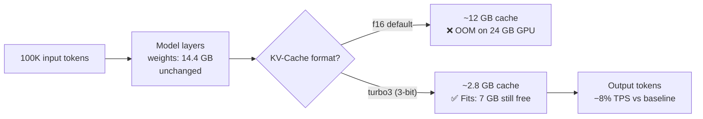

# llama-cpp-turboquant-guide

<div align="center">

[](https://github.com/AI-Engineerings-at/llama-cpp-turboquant-guide)
[](https://arxiv.org/abs/2504.19874)


**TurboQuant (ICLR 2026) quantizes the KV-cache at runtime — not the model weights.**
**Result: 100,000 token context on an RTX 3090. +1.8 GB VRAM. −8% speed.**

*Verified across multiple independent runs. Step-by-step guide with Dockerfile, scripts, and raw benchmark data.*

</div>

---

[TurboQuant (arXiv:2504.19874)](https://arxiv.org/abs/2504.19874) was presented at ICLR 2026. It compresses the KV-cache from 16-bit to 2–4-bit integers during inference. Model weights stay at full precision. This closes the gap between what your GPU can load and what context length it can actually serve.

This repo documents our setup on two consumer GPUs — what we ran into, what we fixed, and what we measured.

**What's in this repo:**
| File | Description |
|------|-------------|
| `Dockerfile` | Builds llama.cpp with TurboQuant (correct repo, branch, cmake flags) |
| `scripts/run-baseline.sh` | Starts llama-server with f16 cache, 8K context |
| `scripts/run-turbo.sh` | Starts llama-server with turbo3 cache, 100K context |
| `scripts/download-model.sh` | Downloads model from HuggingFace via API |
| `results/` | Raw benchmark JSON — all runs, both GPUs |
| `WHITEPAPER.de.md` | German white paper |

**→ [Results](#results) · [How It Works](#how-it-works) · [Quick Start](#quick-start) · [Errors & Fixes](#errors) · [Deutsch](#deutsch)**

---

<a id="results"></a>
## Results

Verified on two consumer GPUs. April 2026.

### RTX 3090 (24 GB) — Mistral-Small-3.2-24B Q4_K_M

*4 independent benchmark runs, 15 total measurements. All runs consistent (±0.3% TPS variance).*

| | Baseline (f16) | TurboQuant turbo3 | Delta |
|--|:--------------:|:-----------------:|:-----:|
| **Context** | 8,192 | **100,000** | **+12.2×** |
| **VRAM used** | 15.3 GB | 17.1 GB | +1.8 GB |
| **Tokens/s** | 51.0 | 47.2 | **−7.5%** |
| **KV-Cache** | ~1 GB (f16) | ~2.8 GB (3-bit) | 4.3× smaller |

> 12× more context. +12% VRAM. −7.5% speed. Same model weights.

```
RTX 3090 — 24 GB VRAM
────────────────────────────────────────────────
Baseline   (f16,    8K ctx):  █████████████░░░░░░  15.3 GB
TurboQuant (turbo3, 100K ctx): ██████████████░░░░░  17.1 GB
                               ↑ weights 14.4 GB fixed
                                              ↑ KV-cache
```

Raw data: [`results/turboquant-3090-all-runs-2026-04.json`](results/turboquant-3090-all-runs-2026-04.json) — 4 runs, 15 measurements

---

### RTX 4070 Laptop (8 GB) — Llama-3.1-8B-Instruct Q4_K_M

*2 independent benchmark sessions. VRAM delta stable at ±2 MB between sessions.*

| | Baseline (f16) | TurboQuant turbo3 | Delta |
|--|:--------------:|:-----------------:|:-----:|
| **Context** | 8,192 | **64,000** | **+7.8×** |
| **VRAM used** | 5.7 GB | 6.2 GB | +0.54 GB |
| **Tokens/s (avg)** | 49.8 | 47.5 | **−4.6%** |

> 7.8× more context. +0.5 GB VRAM. −5% speed.

Raw data: [`results/turboquant-4070-results-2026-04-01.json`](results/turboquant-4070-results-2026-04-01.json) · [`results/turboquant-4070-laptop-2026-04-01.json`](results/turboquant-4070-laptop-2026-04-01.json)

---

### Cross-GPU Summary

| GPU | VRAM | Model | ctx (turbo3) | VRAM delta | Speed loss | Runs |
|-----|------|-------|:------------:|:----------:|:----------:|:----:|
| RTX 3090 | 24 GB | Mistral-Small-3.2 24B | **100,000** | +1.8 GB | −7.5% | 4 |
| RTX 4070 Laptop | 8 GB | Llama-3.1 8B | **64,000** | +0.5 GB | −4.6% | 2 |

The principle scales with the GPU. More VRAM → larger model → larger absolute VRAM savings from compression → more context headroom.

---

<a id="how-it-works"></a>
## How It Works

### The KV-cache problem

Every token you feed into an LLM creates Key-Value vectors that must stay in VRAM for the duration of the request. With f16 (default), this cache grows linearly:

```
Mistral-Small-3.2 24B on RTX 3090 (24 GB):
  Model weights occupy 14.4 GB.  Remaining: ~9.6 GB for KV-cache.

  Context     KV-cache (f16)   Remaining   Status
    8,192          ~1 GB         ~8.6 GB     ✅ fine
   32,000          ~4 GB         ~5.6 GB     ✅ fine
  100,000         ~12 GB        −2.4 GB      ❌ OOM
  100,000      ~2.8 GB (turbo3)  ~6.8 GB     ✅ fine
```

### What TurboQuant does

TurboQuant re-encodes the KV-cache from 16 bits to 2–4 bits on-the-fly. The model reads the quantized cache and generates output normally. The model weights are never touched.

```
f16 KV-cache  →  turbo3 KV-cache
  16 bits     →     3 bits   =  4.3× compression
```

Quality loss at turbo3: <1% perplexity increase (per paper). In practice: not noticeable for most tasks.



### Critical: two repos with confusing names

| Repo | What it is | Used here? |
|------|-----------|:----------:|
| `TheTom/turboquant_plus` | Python research library — HuggingFace models, Python API | ❌ |
| `TheTom/llama-cpp-turboquant` | llama.cpp fork with `--cache-type-k turbo3` | ✅ |

Branch: `feature/turboquant-kv-cache` — **not `master`** (which is a standard llama.cpp fork, no TurboQuant).

---

<a id="quick-start"></a>
## Quick Start

**Requirements:** Docker with NVIDIA runtime, CUDA 12.x, HuggingFace account (free).

### 1. Build the Docker image (~20 min)

```bash
docker build -t turboquant:feature .

# Verify TurboQuant is compiled in — must show turbo2, turbo3, turbo4:
docker run --rm turboquant:feature llama-server -h 2>&1 | grep turbo
```

### 2. Download model (~14 GB)

```bash
export HF_TOKEN=hf_your_token_here
bash scripts/download-model.sh
```

### 3. Run baseline (f16, 8K context)

```bash
bash scripts/run-baseline.sh
# Server on port 8180. Starts in ~45s.
```

### 4. Run TurboQuant (turbo3, 100K context)

```bash
bash scripts/run-turbo.sh
# Server on port 8182. Starts in ~90s — 100K context allocation takes longer.
```

### 5. Test

```bash
# Check context length
curl -s http://localhost:8182/v1/models \
  | python3 -c "import sys,json; print(json.load(sys.stdin)['data'][0]['context_length'])"
# → 100000

# Warmup (first request is cold — don't measure this one)
curl -sf http://localhost:8182/v1/chat/completions \
  -H "Content-Type: application/json" \
  -d '{"model":"local","messages":[{"role":"user","content":"Hi"}],"max_tokens":5}' > /dev/null

# Measure TPS
curl -s http://localhost:8182/v1/chat/completions \
  -H "Content-Type: application/json" \
  -d '{"model":"local","messages":[{"role":"user","content":"Explain transformer attention in detail. At least 400 words."}],"max_tokens":500}' \
  | python3 -c "import sys,json; t=json.load(sys.stdin)['timings']; print(f'{t[\"predicted_per_second\"]:.1f} TPS ({t[\"predicted_n\"]} tokens)')"
```

---

<a id="errors"></a>
## Errors & Fixes

5 errors we ran into during setup. All documented so you can skip them.

### E1: Wrong repository

**Symptom:** Build succeeds. `llama-server -h | grep turbo` returns nothing.
**Cause:** Built from `TheTom/turboquant_plus` — that's a Python library for HuggingFace-style inference. The llama.cpp fork is `TheTom/llama-cpp-turboquant`.
**Fix:** Use the Dockerfile in this repo. It clones the correct repo.

---

### E2: Wrong cmake flag

**Symptom:** CUDA is not used. Inference runs on CPU — extremely slow.
**Cause:** `-DLLAMA_CUBLAS=ON` was renamed to `-DGGML_CUDA=ON` in llama.cpp after the GGML refactor. The old flag compiles without error but is silently ignored.

```dockerfile
# Wrong — silently ignored since llama.cpp GGML refactor:
cmake -DLLAMA_CUBLAS=ON -DLLAMA_CUDA=ON .

# Correct:
cmake -B build -DGGML_CUDA=ON -DCMAKE_BUILD_TYPE=Release
```

---

### E3: `libcuda.so.1` not found at build time

**Symptom:** Docker build fails with `cannot find -lcuda` or linker error for `libcuda.so.1`.
**Cause:** CUDA development images ship a stub `libcuda.so` — the actual driver (`libcuda.so.1`) is injected at container runtime, not available during `docker build`.

```dockerfile
# Add before cmake in your Dockerfile:
RUN ln -sf /usr/local/cuda/lib64/stubs/libcuda.so \
           /usr/local/cuda/lib64/stubs/libcuda.so.1 \
    && echo "/usr/local/cuda/lib64/stubs" > /etc/ld.so.conf.d/cuda-stubs.conf \
    && ldconfig
```

---

### E4: Wrong branch

**Symptom:** `Unsupported cache type: turbo3` at runtime. Build was clean.
**Cause:** The default `master` branch of `llama-cpp-turboquant` is a plain llama.cpp fork. TurboQuant lives on `feature/turboquant-kv-cache`.

```bash
# Wrong — master branch, no TurboQuant:
git clone https://github.com/TheTom/llama-cpp-turboquant.git

# Correct:
git clone https://github.com/TheTom/llama-cpp-turboquant.git \
  --branch feature/turboquant-kv-cache --depth=1
```

Check branches before cloning:
```bash
curl -s "https://api.github.com/repos/TheTom/llama-cpp-turboquant/branches" \
  | python3 -c "import sys,json; [print(b['name']) for b in json.load(sys.stdin)]"
```

---

### E5: Wrong HuggingFace repo name

**Symptom:** 404 or 401 on model download.
**Cause:** Model repo names on HuggingFace change. Don't rely on memory.

```bash
# Always verify first:
curl -s -H "Authorization: Bearer $HF_TOKEN" \
  "https://huggingface.co/api/models?search=bartowski+mistral+small+3.2&limit=5" \
  | python3 -c "import sys,json; [print(m['modelId']) for m in json.load(sys.stdin)]"
```

---

<a id="reproduce"></a>
## Reproduce Our Results

```bash
# 1. Build and start baseline server
docker build -t turboquant:feature .
bash scripts/run-baseline.sh
sleep 45

# 2. VRAM after server start
nvidia-smi --query-gpu=memory.used --format=csv,noheader
# Expected: ~15300 MB

# 3. Warmup (mandatory — first request is cold and gives wrong TPS)
curl -sf http://localhost:8180/v1/chat/completions \
  -H "Content-Type: application/json" \
  -d '{"model":"local","messages":[{"role":"user","content":"Hello"}],"max_tokens":5}' > /dev/null

# 4. 3× TPS measurement
PROMPT='{"model":"local","messages":[{"role":"user","content":"Explain in detail how transformer attention mechanisms work. Cover self-attention, multi-head attention, key-query-value matrices, and positional encoding. Write at least 400 words."}],"max_tokens":500}'
for i in 1 2 3; do
  curl -sf http://localhost:8180/v1/chat/completions \
    -H "Content-Type: application/json" \
    -d "$PROMPT" \
    | python3 -c "import sys,json; t=json.load(sys.stdin)['timings']; print(f'Run $i: {t[\"predicted_per_second\"]:.2f} TPS ({t[\"predicted_n\"]} tokens)')"
done

# 5. Stop, start TurboQuant (100K context needs ~90s to allocate)
docker stop turboquant-baseline
bash scripts/run-turbo.sh
sleep 90

# 6. Repeat steps 2-4 on port 8182
```

**Expected on RTX 3090 + Mistral-Small-3.2 24B:**
- Baseline: 50–52 TPS, VRAM ~15.3 GB
- turbo3 at 100K: 46–48 TPS, VRAM ~17.1 GB

Full benchmark data for comparison: [`results/turboquant-3090-all-runs-2026-04.json`](results/turboquant-3090-all-runs-2026-04.json)

---

## Hardware & Model Compatibility

### GPU VRAM requirements

| VRAM | Recommended model | turbo3 context | Notes |
|------|------------------|:--------------:|-------|
| 6 GB | Llama-3.2 3B Q4_K_M (~2 GB) | ~200K | Very fast, limited capability |
| 8 GB | Llama-3.1 8B Q4_K_M (4.7 GB) | ~64K | **Verified** — our RTX 4070 setup |
| 12 GB | Qwen2.5 14B Q4_K_M (~8.5 GB) | ~80K | Estimated |
| 24 GB | Mistral-Small-3.2 24B Q4_K_M (14.4 GB) | ~100K | **Verified** — our RTX 3090 setup |

*Estimates for non-verified rows depend on model architecture and batch size.*

### System requirements

| Component | Minimum | Our setups |
|-----------|---------|-----------|
| GPU | CUDA-capable, VRAM per table above | RTX 3090 / RTX 4070 Laptop |
| System RAM | 16 GB | 32 GB / 16 GB |
| Disk | 20 GB free | SSD |
| CUDA | 12.x | 12.6.3 |
| OS | Linux, or Windows with Docker Desktop | Windows + Docker Desktop |

**Windows:** Docker Desktop works. Use named Docker volumes for models — avoid `/tmp/` paths.

---

## License

Content and scripts: [CC BY 4.0](LICENSE)
Based on [TurboQuant (arXiv:2504.19874)](https://arxiv.org/abs/2504.19874) by Thomas et al., ICLR 2026
llama.cpp fork: [TheTom/llama-cpp-turboquant](https://github.com/TheTom/llama-cpp-turboquant)

---

<a id="deutsch"></a>
## 🇩🇪 Deutsch

### TurboQuant auf Consumer-Hardware — Praktischer Guide

Dieses Repository dokumentiert unsere Ergebnisse mit TurboQuant (ICLR 2026) auf zwei Consumer-GPUs — inklusive aller 5 Fehler die wir gemacht haben und wie wir sie gelöst haben.

**TurboQuant komprimiert den KV-Cache von 16-Bit auf 2–4-Bit während der Inferenz. Die Modellgewichte bleiben unverändert.**

### Ergebnisse

**RTX 3090 (24 GB), Mistral-Small-3.2 24B Q4_K_M** — 4 unabhängige Runs:
- Context: 8.192 → **100.000 Tokens** (+12,2×)
- VRAM-Mehrverbrauch: nur **+1,8 GB** (statt ~12 GB die f16 bei 100K bräuchte)
- Geschwindigkeitsverlust: nur **−7,5%** (51,0 → 47,2 Tokens/s)

**RTX 4070 Laptop (8 GB), Llama-3.1 8B Q4_K_M** — 2 unabhängige Sessions:
- Context: 8.192 → **64.000 Tokens** (+7,8×)
- VRAM-Mehrverbrauch: nur **+0,5 GB**
- Geschwindigkeitsverlust: nur **−4,6%**

### Warum das relevant ist

Größerer Context bedeutet: längere Dokumente verarbeiten, besseres RAG, mehr Gesprächshistorie — alles auf einer einzigen Consumer-GPU. Keine Cloud-Kosten, keine Datenschutz-Probleme.

### Schnellstart

```bash
# Image bauen (~20 Minuten)
docker build -t turboquant:feature .

# TurboQuant-Unterstützung prüfen (muss turbo2, turbo3, turbo4 zeigen):
docker run --rm turboquant:feature llama-server -h 2>&1 | grep turbo

# Modell herunterladen (~14 GB)
export HF_TOKEN=dein_token
bash scripts/download-model.sh

# Baseline starten (f16, 8K Context, Port 8180)
bash scripts/run-baseline.sh

# TurboQuant starten (turbo3, 100K Context, Port 8182)
# Hinweis: Startup dauert ~90s — 100K Context-Allokation braucht länger als 8K
bash scripts/run-turbo.sh
```

### Die 5 Fehler — Kurzfassung

1. **Falsches Repo** — `turboquant_plus` ist eine Python-Bibliothek, nicht der llama.cpp Fork → [E1](#errors)
2. **Falsches cmake-Flag** — `-DLLAMA_CUBLAS=ON` wird still ignoriert, korrekt: `-DGGML_CUDA=ON` → [E2](#errors)
3. **`libcuda.so.1` fehlt** — Symlink vor cmake notwendig → [E3](#errors)
4. **Falscher Branch** — `master` hat kein TurboQuant, korrekt: `feature/turboquant-kv-cache` → [E4](#errors)
5. **Falscher HF-Repo-Name** — Immer per API prüfen, nie aus dem Gedächtnis → [E5](#errors)

Vollständige deutsche Dokumentation: [`WHITEPAPER.de.md`](WHITEPAPER.de.md)

---

*[AI Engineering Lab](https://ai-engineering.at) · April 2026*
